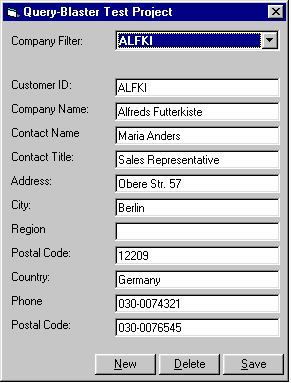



## MS Access/ADO/Stored Query Test Project

### Description

This VB test project demonstrates how to insert, delete, update and select from a Microsoft Access database using parameterized stored queries and ADO command objects. .mdb file in included.
 
### More Info
 
.mdb file is included in test project.

             |
---                |---
**Submitted On**   |2000-07-29 14:47:42
**By**             |[Brian Lockwood](https://github.com/Planet-Source-Code/PSCIndex/blob/master/ByAuthor/brian-lockwood.md)
**Level**          |Intermediate
**User Rating**    |5.0 (35 globes from 7 users)
**Compatibility**  |VB 6\.0
**Category**       |[Databases/ Data Access/ DAO/ ADO](https://github.com/Planet-Source-Code/PSCIndex/blob/master/ByCategory/databases-data-access-dao-ado__1-6.md)
**World**          |[Visual Basic](https://github.com/Planet-Source-Code/PSCIndex/blob/master/ByWorld/visual-basic.md)
**Archive File**   |[CODE\_UPLOAD83337292000\.zip](https://github.com/Planet-Source-Code/brian-lockwood-ms-access-ado-stored-query-test-project__1-10189/archive/master.zip)

